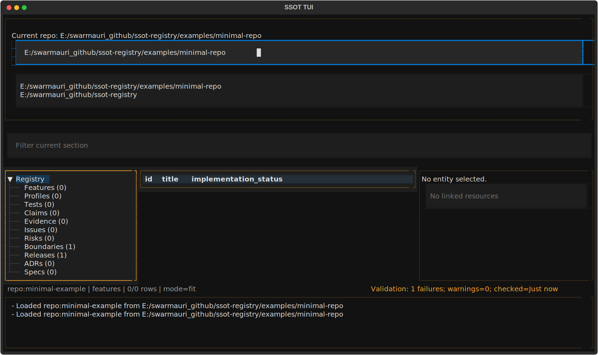
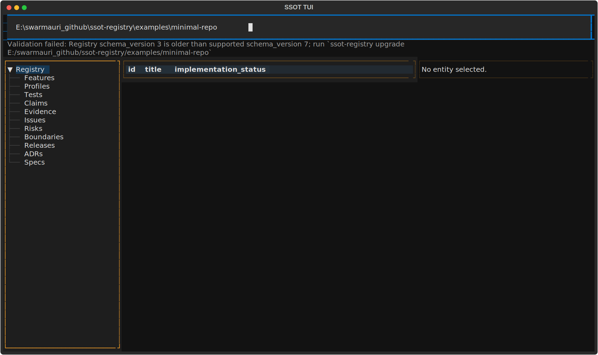

<div align="center">
  <h1>🔷 ssot-tui</h1>
  <p><strong>Textual terminal UI for browsing SSOT registries.</strong></p>
</div>

<div align="center">
  <a href="https://pypi.org/project/ssot-tui/"></a>
  <a href="https://pypi.org/project/ssot-tui/"></a>
  <a href="https://pepy.tech/project/ssot-tui"></a>
  <a href="https://hits.sh/github.com/groupsum/ssot-registry/"></a>
</div>

`ssot-tui` is a Textual-based terminal UI for browsing SSOT registries.

It is currently focused on navigation and read-oriented exploration rather than full workflow parity with the CLI.

## What this package owns

- The `ssot-tui` console entry point
- The Textual app shell and browser screen
- TUI widgets for section navigation, entity tables, and detail panes

## When to use this package

Use `ssot-tui` when you want:

- an interactive terminal browser for SSOT registry content
- a navigable view across entity sections without dropping into raw JSON
- a Textual UI on top of the `ssot-registry` runtime

Use another package when you want:

- `ssot-cli` for full command-line workflow coverage
- `ssot-registry` for direct Python API access
- `ssot-contracts` for packaged schemas and templates
- `ssot-views` for report and graph builders
- `ssot-codegen` for regeneration of metadata artifacts

## Install

```bash
python -m pip install ssot-tui
```

For local development from this repository:

```bash
python -m pip install -e pkgs/ssot-tui
```

This package depends on `ssot-registry`, `ssot-contracts`, and `textual`.

## Start the TUI

```bash
ssot-tui
```

The current entry point launches `SsotTuiApp`, which mounts a browser-oriented screen when the application starts.

## Screenshots

Captured against [`examples/minimal-repo`](../../examples/minimal-repo/README.md) in this workspace:





## Current scope

The current implementation is intentionally narrow:

- browser-first navigation
- section-based movement across registry entities
- tabular entity browsing
- detail-pane inspection for the selected item

The package does not currently document full CRUD or guided operational workflows, because those flows are not yet implemented here with CLI-level parity.

## Main UI concepts

The current source tree exposes these UI building blocks:

- `BrowserScreen`: the primary browser screen
- `SectionNavigation`: a section chooser for registry entity groups
- `EntityTable`: a table view for entities in the active section
- `EntityDetailPane`: a detail view for the current selection

At the application level, `SsotTuiApp` provides a header, footer, and browser screen composition.

## Package relationships

- Package type: terminal UI package
- Depends on: `ssot-registry`, `ssot-contracts`, `textual`
- Consumed by: users who want interactive browsing on top of the core SSOT runtime

If you need complete operational coverage today, use `ssot-cli`. If you want an interactive terminal browser for current registry content, this package is the right entry point.
